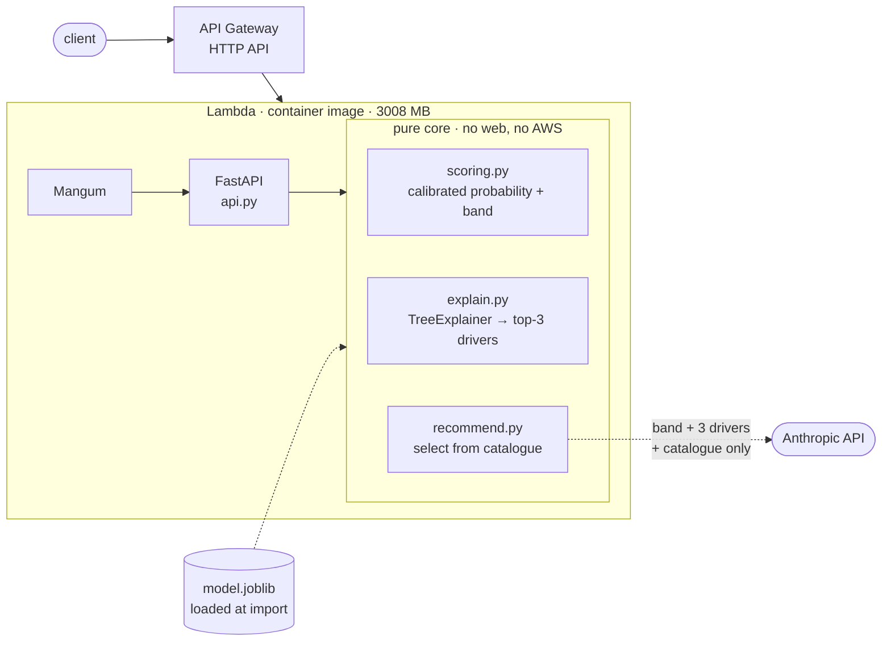

# Churn Risk API

[](https://github.com/emdomingo/churn-risk-api/actions/workflows/ci.yml)

**Given a customer, return how likely they are to churn, why, and what to offer them to keep them.** A calibrated probability, the SHAP drivers behind it, and one retention action picked from a fixed catalogue, served as a container-image Lambda behind API Gateway.

**Live:** `https://03bmm97sm6.execute-api.ap-southeast-2.amazonaws.com`

**Stack:** Python, XGBoost, SHAP, FastAPI, AWS Lambda + API Gateway, CloudFormation, GitHub Actions (OIDC, no long-lived keys), Anthropic API.

`ROC-AUC 0.833 · PR-AUC 0.638 · Brier 0.141 · 142 offline tests · deployed from a green CI merge on every push to main`

A retention team can only call so many customers a week. The service answers the three questions that decide who gets called, and the LLM only ever *selects* from five approved offers, so a recommendation is always an auditable, costed action rather than invented prose.

---

## Try it

Runs against the live service, no clone required. Paste the setup, then each route is a one-liner.

```bash
API='https://03bmm97sm6.execute-api.ap-southeast-2.amazonaws.com'
CUST='{"customerID":"TEST-0001","gender":"Female","SeniorCitizen":0,"Partner":"No","Dependents":"No","tenure":2,"PhoneService":"Yes","MultipleLines":"No","InternetService":"Fiber optic","OnlineSecurity":"No","OnlineBackup":"No","DeviceProtection":"No","TechSupport":"No","StreamingTV":"Yes","StreamingMovies":"Yes","Contract":"Month-to-month","PaperlessBilling":"Yes","PaymentMethod":"Electronic check","MonthlyCharges":98.7,"TotalCharges":197.4}'

curl -s "$API/health"                                                                    # build + readiness
curl -s -X POST "$API/score"     -H 'Content-Type: application/json' -d "{\"customers\":[$CUST]}"  # batch: probability + band
curl -s -X POST "$API/explain"   -H 'Content-Type: application/json' -d "{\"customer\":$CUST}"     # + top-3 SHAP drivers
curl -s -X POST "$API/recommend" -H 'Content-Type: application/json' -d "{\"customer\":$CUST}"     # + one catalogue action
```

`/recommend` returns the score, drivers, and a chosen action with its rationale:

```json
{
  "customerID": "TEST-0001",
  "probability": 0.7565,
  "band": "high",
  "drivers": [
    {"feature": "tenure",                  "value": 2,     "contribution": 0.5662, "direction": "increases"},
    {"feature": "MonthlyCharges",          "value": 98.7,  "contribution": 0.4265, "direction": "increases"},
    {"feature": "Contract=Month-to-month", "value": "Month-to-month", "contribution": 0.3947, "direction": "increases"}
  ],
  "action": "contract_term_incentive",
  "rationale": "Month-to-month contract, short tenure, high monthly charges: a discounted term addresses the contract-type risk and the price burden at once.",
  "reason": null
}
```

The catalogue is `fee_waiver`, `plan_downgrade`, `contract_term_incentive`, `support_callback`, `loyalty_perk`, and nothing else can come back. Swap any field to move the score; `tenure`, `Contract`, `MonthlyCharges`, and `InternetService` carry the most weight.

Warm timings: `/health` and `/explain` 60–100 ms, `/score` ~550 ms, `/recommend` 3–5 s (live LLM call). The first request after a deploy returns 503, see [Cold start](#cold-start).

---

## How it works



**Pure core, thin edges.** All the churn logic lives in plain functions under `src/churn/` that import no web framework and no AWS. FastAPI, Mangum, and the Anthropic client are thin adapters around that core, so the test suite runs entirely offline.

The model loads once at startup rather than per request, so callers don't pay for it, at the cost of a slow first request after each deploy (see [Cold start](#cold-start)).

The LLM never sees the customer record or ID, only the risk band, the top three drivers, and the catalogue. It selects and justifies; the service validates the choice before returning it.

---

## Design decisions

**The LLM selects, it never invents.** A retention offer is a commitment with a cost, so the LLM is restricted to five catalogue identifiers rather than free text. That turns generation into selection: finance signs off on the five offers once, and a test asserts nothing else can ever be returned.

**`/recommend` degrades, it never 500s.** If the LLM fails, times out, or returns an action that isn't in the catalogue, the route still returns 200 with the score and drivers, `action: null`, and a machine-readable `reason`. The retention team always gets the risk assessment, and a bad LLM answer becomes "no action" rather than an unauthorised one.

**Drivers can be protective and can name a level the customer lacks.** One-hot encoding keeps every level, so a customer carries a contribution for levels they do *not* have. A protective `Contract=Month-to-month` driver means the model is pricing its absence, and `value` reports the customer's actual value on the source column, which is why `feature` and `value` can disagree.

**The threshold is derived, not picked.** `MISSED_CHURNER_COST_RATIO = 5.0` (one missed churner costs about five wasted offers) gives the operating threshold `1 / (1 + 5) = 0.167`. That same cut is the low/medium band boundary, so "not low" and "the model says intervene" are one predicate. A test fails if the two ever drift apart.

**SHAP explains the uncalibrated margin.** `CalibratedClassifierCV` wraps the booster; `TreeExplainer` runs on the booster underneath. The returned *score* is calibrated while the *drivers* explain the pre-calibration margin, and contributions are in margin units that do not sum to the probability. Defensible rather than ideal: calibration is a monotone map, so driver ranking is unaffected. Explaining the calibrated output directly would need KernelSHAP, orders of magnitude slower per request.

---

## The model

A single gradient-boosted tree on the Telco churn dataset. Test split, 1409 rows, seed 42, base churn rate 26.5%.

| Metric | Test | Why this metric |
|---|---|---|
| ROC-AUC | **0.833** | Ranking across all thresholds. Flatters on a 26% positive class, so not the headline. |
| PR-AUC | **0.638** | Ranking on the class that matters. No-skill is 0.265. |
| Brier | **0.141** | Whether scores are probabilities, not just an ordering (0.168 uncalibrated); this is what justifies attaching a budget to "76%". |
| tenure-only baseline | 0.734 | The floor the model has to beat to be worth deploying. |
| ROC-AUC, train | 0.870 | Overfit check. The 0.037 gap is the memorisation. |

Accuracy is absent on purpose: predicting "nobody churns" scores 73.5% here and is worthless.

At `p ≥ 0.167` the model recalls 86.4% of churners at 48.1% precision, flagging 47.7% of the base.

- **Calibration is sigmoid, not isotonic.** ~1,400 validation rows are too few for isotonic's staircase to be anything but overfitting, and the distortion from `scale_pos_weight` is close to a constant log-odds shift, which two parameters undo. The validation split is touched by nothing but the calibrator.
- **Tree count and depth come from a 20% stopping slice carved out of *train*,** not a fixed budget; a fixed 300-tree count was tried first and measurably overfit. The booster is then refit at the chosen count so no unused early-stopped trees ship, which keeps the SHAP explanation exact.
- **Imbalance is handled with `scale_pos_weight = 2.769`,** not resampling. It reweights the objective without inventing or discarding rows, and its distortion is what the calibration step corrects.
- **The global SHAP top 10 matches a univariate prior registered in `exploration.ipynb` *before* the model was fitted,** and contains none of `gender`, `PhoneService`, or `MultipleLines`.

---

## Cold start

The first request after a deploy returns 503. Measured, understood, and left in place:

1. Init streams a 1.28 GB image (already trimmed from 2.1 GB by dropping the unused `nvidia-` CUDA packages xgboost pulls in), imports pandas / sklearn / shap / xgboost, and loads the artifact, overrunning Lambda's 10s init cap.
2. Lambda suppresses the timeout and re-runs init *inside* the invocation, about 20.5s.
3. 10 + 20.5s overruns API Gateway's 29s ceiling and the caller gets a 503. Every request after that is fast.

The fix would be to defer the heavy imports out of module scope, but that only moves the 20s from a 503 into a slow first 200, and provisioned concurrency, which would actually remove it, costs $19–32/month and ends the free-tier story. So the deploy pipeline and smoke test retry through it rather than hiding it.

---

## Deploy

Every push to `main` runs the tests, and only if they pass, builds the image, pushes it to ECR, updates the CloudFormation stack, and confirms the live URL is serving the new build.

- **No AWS keys are stored anywhere.** GitHub authenticates to AWS per run with a short-lived OIDC token, scoped so only this repo's `main` branch can deploy. Forks and pull requests are rejected, which is what makes a public repo safe to deploy from.
- **The deploy pipeline can't escalate its own access.** It can update this one app and nothing else, and it can't create IAM roles, so a compromised workflow can't grant itself more.
- **Every response says which build served it.** Image tags are commit SHAs, so `model_version` in the API output maps straight back to a line of code.

---

## Run it locally

```bash
uv sync --all-groups                        # install
uv run pytest                               # 142 tests, offline, no AWS
uv run ruff check .                         # lint
uv run --group train python -m churn.train  # train → calibrate → SHAP → artifacts/
uv run uvicorn churn.api:app --reload       # serve on :8000
docker build -t churn:local .               # trains in stage 1; ~1.28 GB
```

The suite never loads a prebuilt model. `tests/conftest.py` trains a tiny one on a committed 200-row fixture at session scope, which is what lets CI run with no AWS, no network, and no artifact in git.

---

## What I'd do next

- **Monitoring.** The structured JSON logs already carry request ID, latency, and score. A CloudWatch metric filter on the `/recommend` degradation rate matters most: a rising `action: null` rate is an LLM outage nobody would otherwise notice, because the route returns 200 by design.
- **Drift.** PSI on the live score distribution against the test split, plus per-feature PSI on the top drivers, is the only early signal when churn labels lag by a billing cycle.
- **Auth and rate limiting.** The live URL is open. Fine when the function ran keyless, a real gap now that `/recommend` costs money per call. An API Gateway usage plan with a key is the small version.
- **A temporal split.** The current split is random, leaking calendar time across train and test. A time-ordered split would give an honest estimate on the customers the model will actually see next.

---

MIT licensed.
